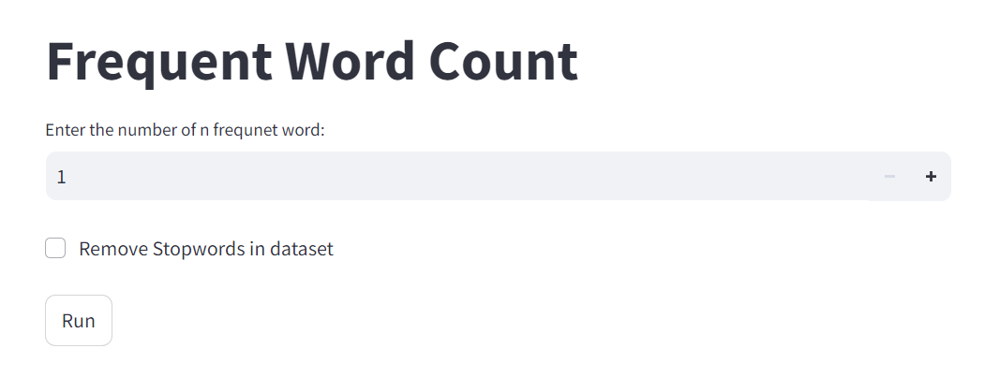

# PicoVoice Assessment

## Language
Python

# How to run?
### STEPS:

### Step 1 : Clone the github repository

Clone the repository

### Step 2 : Create python enviroments and activate

Create enviroments
```bash
python -m venv myenv
```

Activate enviroments
```bash
myenv\Scripts\activate
```

### Step 3 : install the requirements.txt file
```bash
pip install -r requirement.txt
```

## Problem Statement:

1. The probability of rain on a given calendar day in Vancouver is p[i], where i is the day's index.
For example, p[0] is the probability of rain on January 1st, and p[10] is the probability of precipitation on January 11th.
Assume the year has 365 days (i.e., p has 365 elements). What is the chance it rains more than n (e.g., 100) days in Vancouver?
Write a function that accepts p (probabilities of rain on a given calendar day) and n as input arguments and returns the
possibility of raining at least n days.

#### Soluation: Binomial Distribution Probability

#### Output:
Here, used Streamlit to display output
Final Ouptut Screen: 
#### 1
       

Enter the probability of rain in given day and number of day when rains more than n


2. A phoneme is a sound unit (similar to a character for text). We have an extensive pronunciation dictionary (think millions of words).Given a sequence of phonemes as input (e.g. ["DH", "EH", "R", "DH", "EH", "R"]), find all the combinations of the words that
can produce this sequence (e.g. [["THEIR", "THEIR"], ["THEIR", "THERE"], ["THERE", "THEIR"], ["THERE", "THERE"]]). You can
preprocess the dictionary into a different data structure if needed.

#### Soluation: Tree data structure.

#### Output:
       

3. Find the n most frequent words in the TensorFlow Shakespeare dataset.

#### Soluation: Natrual Language Processing (NLP)

#### Output:

#### 1
      


#### 2
#### Give input of number of word count and get the output click on submit button
    

#### 3
#### If you want to remove stopword then click on check of "Remove Stopwords in dataset"


